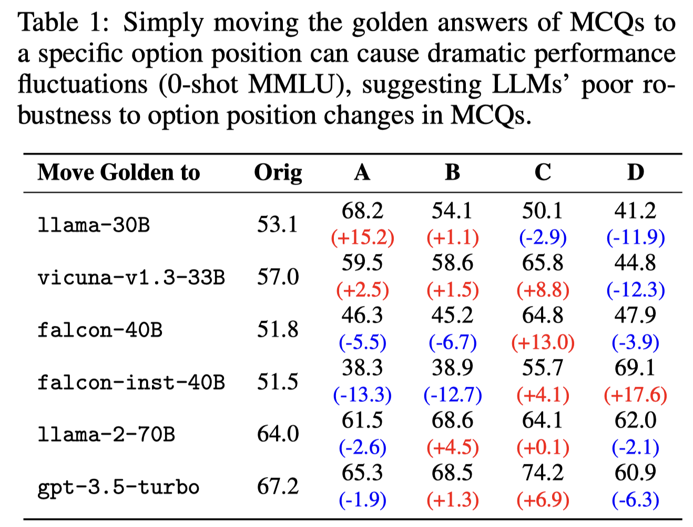
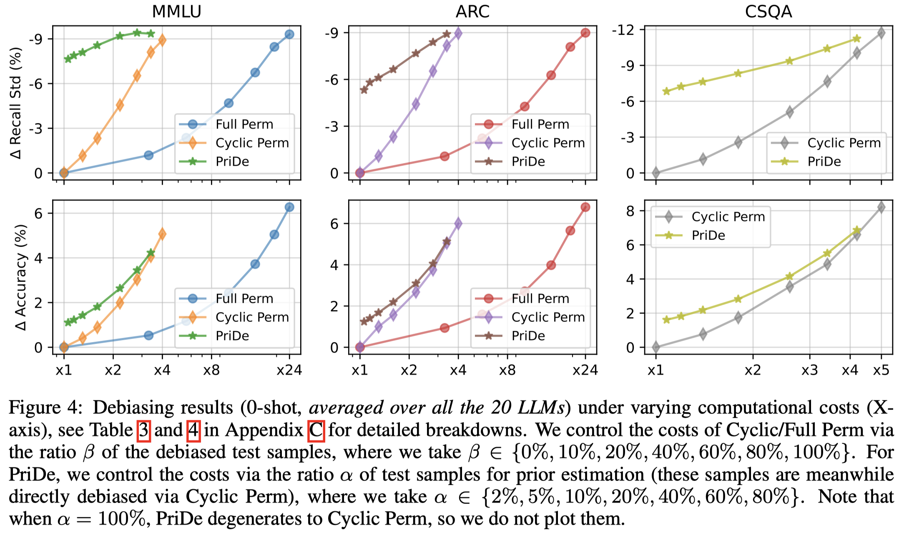
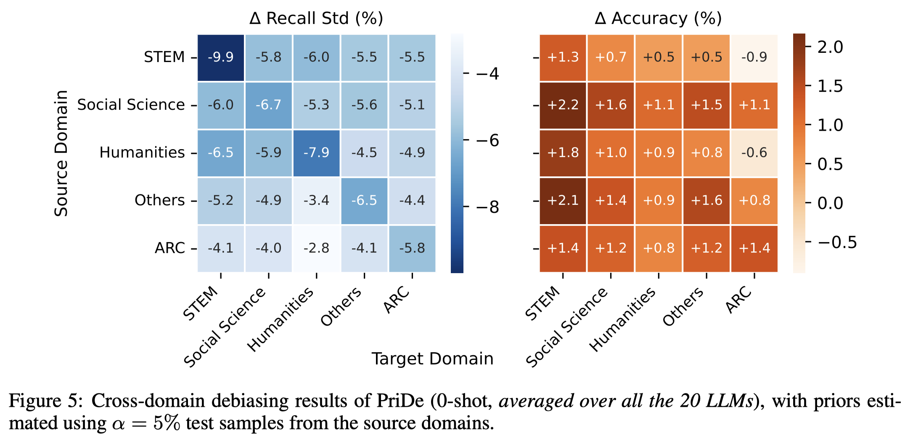

# LLM-MCQ-Bias
Official repository for our ICLR 2024 paper "[Large Language Models Are Not Robust Multiple Choice Selectors](https://arxiv.org/abs/2309.03882)"

If you find this repository useful or our work is related to your research, please kindly cite it:

```latex
@inproceedings{
  llm-mcq-bias,
  title={Large Language Models Are Not Robust Multiple Choice Selectors},
  author={Chujie Zheng and Hao Zhou and Fandong Meng and Jie Zhou and Minlie Huang},
  booktitle={The Twelfth International Conference on Learning Representations},
  year={2024},
  url={https://openreview.net/forum?id=shr9PXz7T0}
}
```

## Overview

Multiple choice questions (MCQs) serve as a common yet important task format in the evaluation of large language models (LLMs). This work shows that modern LLMs are vulnerable to option position changes in MCQs due to their inherent "**selection bias**", namely, they prefer to **select specific option IDs as answers** (like "Option A"). As a result, modern LLMs are **vulnerable to option position changes in MCQs**, as shown below:



Through extensive empirical analyses with 20 LLMs on three benchmarks, we pinpoint that this behavioral bias primarily stems from LLMs' **token bias**, where the model **a priori assigns more probabilistic mass to specific option ID tokens** (e.g., A/B/C/D) when predicting answers from the option IDs. In contrast, selection bias arises **less from LLMs’ position bias**, where they are deemed to favor options presented at specific ordering positions (like first or last).

To mitigate selection bias, we propose a label-free, inference-time debiasing method, called PriDe, which separates the model's prior bias for option IDs from the overall prediction distribution. PriDe first estimates the prior by permutating option contents on a small number of test samples, and then applies the estimated prior to debias the remaining samples.

We demonstrate that PriDe achieves interpretable and transferable debiasing with high computational efficiency.





## Code and Data

See `code` for the experimental code for reproducing our experimental results.

We also release the experimental results on HuggingFace: https://huggingface.co/datasets/chujiezheng/LLM-MCQ-Bias
